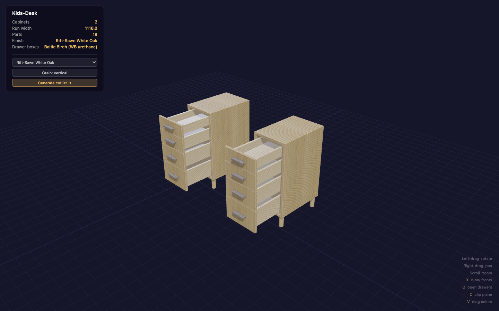
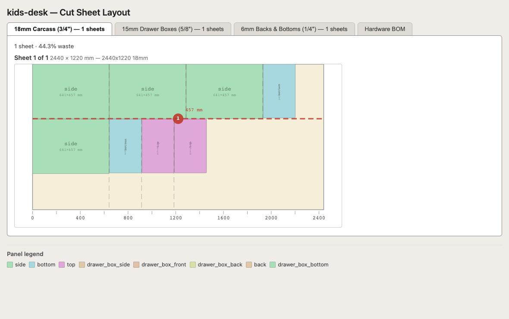

# cabinet-mcp

Design kitchen and furniture cabinets conversationally. Talk to Claude, get back validated configurations, optimised cutlists, and interactive 3D previews — with real Blum/Accuride/Salice hardware specs, five carcass joinery methods, eight procedural wood finishes, and proportions rooted in traditional cabinet-making.



*A two-pedestal desk in rift-sawn white oak with Baltic-birch drawer boxes. One keystroke slides every drawer open; the side panel switches wood finish and grain direction live.*

## Get started in two commands

```bash
uv pip install -e ".[full]"
claude mcp add cabinet -- uv --directory $(pwd) run cabinet-mcp
```

Then ask Claude anything:

> Design a 900 mm 3-drawer kitchen base with BLUMOTION slides and a classic drawer graduation.

> Make me a bathroom vanity with two doors and an inset shelf. Softclose hinges.

> Generate a cutlist for the workshop cabinet I just designed.

That's it. Claude drives the parametric engine through an MCP server — you never need to touch Python directly.

For Claude Desktop, Gemini CLI, or HTTP/SSE mode, see [docs/mcp.md](docs/mcp.md).

## From conversation to cut sheets

A design session ends in things you can actually build from:

1. **A validated design.** Every configuration runs through clearance, deflection, geometry, joinery, hardware-fit, and pull fit/style checks that return typed issues — graded by severity, with measured values — not just "invalid".
2. **An interactive 3D preview.** A single HTML file with the model embedded — no install, no local server; Three.js loads from a CDN, so a browser and an internet connection are all you need. Works for single cabinets or whole multi-cabinet projects. Keyboard shortcuts x-ray the fronts, slide the drawers open, cut a clip plane through the carcass, and color-code panels for inspection. A dropdown re-textures the show surfaces live — rift-sawn white oak to walnut, bamboo, or cherry — with a grain-direction toggle and a one-click cutlist request that captures your selections. Drawer boxes always render as Baltic birch, the way they're actually built.
3. **A cutlist you can hand to the saw.** Consolidated BOM, guillotine sheet optimisation with numbered breakdown cuts, per-thickness sheet tabs, hardware BOM with pack-quantity and leftover math, and JSON/CSV/HTML/PDF export.



*One 2440 × 1220 sheet of the desk's 18 mm carcass panels — the dashed red line is guillotine cut #1, and the tabs switch between the three sheet thicknesses.*

## Install options

| Command | What you get |
|---|---|
| `uv pip install -e ".[full]"` | **Recommended.** CadQuery (3D + HTML viewer) + rectpack (sheet optimizer) |
| `uv pip install -e ".[cad]"` | CadQuery only — 3D geometry, interference checks, HTML viewer |
| `uv pip install -e .` | **Lite.** Pure-Python only — parametric design, evaluation, cutlist BOM, MCP server |

With `uv run`, the full install is the default (configured via `default-groups = ["full", "dev"]` in `pyproject.toml`). To run in lite mode: `uv run --no-group full cabinet-mcp`.

## Using it from Python

```python
from cadquery_furniture.presets import get_preset
from cadquery_furniture.evaluation import evaluate_cabinet, print_report

cfg = get_preset("kitchen_base_3_drawer").config
print_report(evaluate_cabinet(cfg))
```

The parametric core, evaluation engine, and cutlist BOM all work in lite mode (no CadQuery). 3D geometry, interference checks, and the HTML viewer require the `cad` or `full` extra.

## What it knows

- **Hardware** — seven drawer slides, seven Blum Clip Top hinges, four furniture legs — [docs/hardware.md](docs/hardware.md)
- **Pulls and knobs** — 45 catalog entries (Top Knobs, Rockler, Richelieu, Hafele, IKEA) with placement policy, fit checks, and pack-quantity BOM math — [docs/pulls.md](docs/pulls.md)
- **Joinery** — four drawer corner joints and five carcass methods, all parametric — [docs/joinery.md](docs/joinery.md)
- **Proportions** — graduated drawers and asymmetric column widths via named ratios — [docs/proportions.md](docs/proportions.md)
- **Presets** — twenty-six pre-validated starting points for kitchen, workshop, bedroom, bathroom, office, entryway, and living-room furniture — [docs/presets.md](docs/presets.md)
- **Multi-cabinet projects** — shared design tokens across a run of cabinets, cross-cabinet consistency checks, merged project cutlists
- **Auto-repair** — single-pass fixer for common stack/rabbet errors
- **MCP server** — twenty-three tools over stdio or HTTP/SSE — [docs/mcp.md](docs/mcp.md)
- **Eval harness** — 283 scenarios / 940 assertions across eight domain tags (kitchen, workshop, bedroom/bathroom, furniture maker, cabinet maker, homeowner, and more), runs in under a second — [docs/evals.md](docs/evals.md)

For the module layout and data flow, see [docs/architecture.md](docs/architecture.md).

## Running tests

```bash
uv run pytest tests/ -v        # unit + integration
uv run python -m evals         # full scenario suite (< 1 second)
```

Neither requires CadQuery (CadQuery-dependent tests are skipped automatically in lite mode).

## Troubleshooting

If the server won't start or Claude isn't seeing the tools, see [docs/local-setup.md](docs/local-setup.md) for a full walkthrough — install verification, Claude Code and Claude Desktop config, HTTP/SSE mode, and fixes for the most common macOS problems (PATH in GUI apps, CadQuery build failures, port conflicts, reading the MCP logs).

## Attributions

Hardware dimensions, placement rules, part numbers, and joinery references come from manufacturer datasheets and woodworking literature. See [ATTRIBUTIONS.md](ATTRIBUTIONS.md) for full citations.
